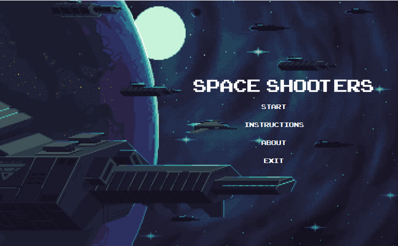
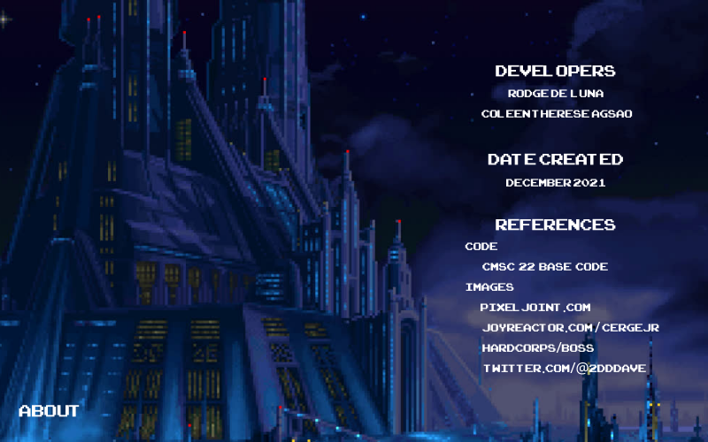
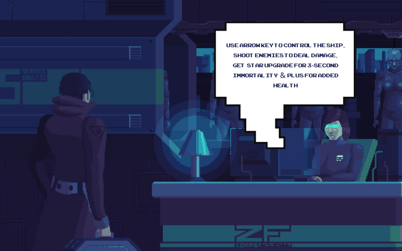

# Space Shooters: A Single-Player Space Shooter Game

## Description
Space Shooters is a Java-based single player shooting arcade game, featuring a boss encounter and a variety of power-ups to aid the player. This application is developed with a focus on the application of object-oriented programming principles.

## Technologies Used

## Installation
To run the project locally, follow these steps:

1. Clone the repository: `https://github.com/coleenagsao/bedev-social-network-website.git`
2. Under src, run `Main.java`

## Screenshots

*Screenshot of the Splash Screen*

*Screenshot of the About Game Page*

*Screenshot of the Instructions Page*

## License
This project is licensed under the [Creative Commons Attribution-NonCommercial-ShareAlike (CC BY-NC-SA) 4.0 International License](https://creativecommons.org/licenses/by-nc-sa/4.0/).

## Additional Notes
Space Shooters is an academic project developed as a part of CMSC 22 (Object-Oriented Programming) in UPLB. 